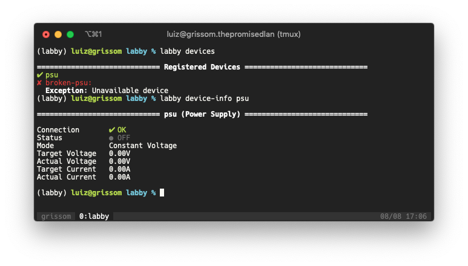

# 🐕 labby

[](https://travis-ci.com/luizribeiro/labby)
[](https://codecov.io/gh/luizribeiro/labby)

An application for interacting with laboratory equipment and running
sequences of experiments.



## Usage

See [`luizribeiro/workbench`](https://github.com/luizribeiro/workbench) for an example.

## Contributing

1. Start by forking this repository and checking it out.
2. Install all the development dependencies with:
```
pipenv install -d
```
3. Enter the virtual environment:
```
pipenv shell
```
4. Install labby locally on the virtual environment in editable mode:
```
pip install -e .
```

Your development environment should be good to go from here. Now you can
use `labby` as usual from the command-line while making changes to `labby`
itself:
```
labby devices
```

We use [`green`](https://github.com/CleanCut/green) for running tests:
```
green
```

We also use the [`pyre`](https://pyre-check.org/) type-checker for static type-checking:
```
pyre
```

We use [`flake8`](https://flake8.pycqa.org/en/latest/) for linting:
```
flake8
```


You can install [`pre-commit`](https://pre-commit.com/) hooks with, which
will automatically run lint, static typechecking and tests automatically
before each commit:
```
pre-commit install
```
